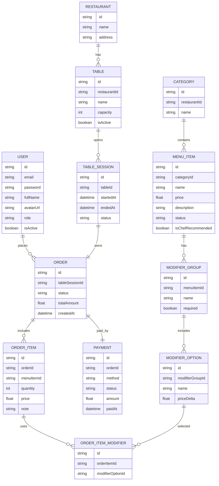

# Smart Restaurant – QR Menu Ordering System

## 1. System Overview

Smart Restaurant is a QR-based menu ordering system for dine-in service that helps restaurants digitize menus, streamline ordering, and manage kitchen workflows efficiently.

Key capabilities:

- Digital menu management with categories, items, and modifiers
- QR code generation for each table
- Customers scan QR codes to browse menu and place orders
- Single active order per table session (pay-after-meal model)
- Real-time order tracking via Kitchen Display System (KDS)
- Integrated payment gateway (Stripe / VNPay / MoMo / ZaloPay)
- Revenue reports and analytics

> **Scope note:** This is a **single-restaurant system**. Multi-tenant support is not included.

---

## 2. Technology Stack

| Layer          | Technology                                  |
| -------------- | ------------------------------------------- |
| Architecture   | Single Page Application (SPA)               |
| Frontend       | ReactJS / NextJS                            |
| Backend        | NodeJS (Express)                            |
| Database       | PostgreSQL / MySQL (via Prisma ORM)         |
| Authentication | Passport.js + JWT                           |
| Real-time      | Socket.IO / WebSocket                       |
| Payment        | Stripe (extensible to VNPay, MoMo, ZaloPay) |
| Caching        | Redis (optional)                            |
| Deployment     | Docker, Public Hosting                      |

---

## 3. User Roles

| Role          | Description                                               |
| ------------- | --------------------------------------------------------- |
| Guest         | Customer scanning QR code to browse menu and place orders |
| Customer      | Registered user with order history and profile            |
| Super Admin   | System-level administrator managing Admin accounts        |
| Admin         | Restaurant owner with full management permissions         |
| Waiter        | Accepts orders, manages table service                     |
| Kitchen Staff | Uses KDS to prepare orders                                |

---

## 4. Key User Flows

### 4.1 Restaurant Setup (Admin)

Super Admin → Create Admin → Admin Login → Menu Creation → Table Setup → QR Code Generation

### 4.2 Customer Registration

Sign Up → Email Verification → Login → Access Order History

### 4.3 Customer Ordering (Dine-in Only)

Scan QR → View Menu → Add to Cart → Customize with Modifiers → Submit Items → Track Order → Add More Items → Request Bill → Payment

> Customers can add more items to their **current unpaid order** at any time. All items belong to **one order per table session**.

### 4.4 Waiter Order Acceptance

Customer Places Order → Waiter Receives Notification → Review → Accept/Reject → Send to Kitchen

### 4.5 Order Processing (Kitchen)

Received → Preparing → Ready → Served → Completed

---

## 5. Database Design (ERD)

### 5.1 Entity Relationship Diagram (Mermaid)

---

## 6. Core Features

### Customer (Dine-in)

- QR-based menu access
- Menu browsing with search and filters
- Shopping cart with modifiers
- Add items to active order
- Real-time order tracking
- Request bill and pay after meal

### Waiter

- Receive real-time order notifications
- View orders by table
- Accept or reject order items
- Send orders to kitchen
- Mark orders as served

### Kitchen Staff (KDS)

- Real-time order queue
- Order timers and alerts
- Update item status (Preparing → Ready)

### Admin

- Menu and category management
- Modifier and pricing configuration
- Table and QR code management
- Order monitoring via KDS
- Revenue reports and analytics
- Staff account management

---

## 7. Advanced Features (Optional)

- Redis caching for menu and session data
- Fuzzy search for menu items
- Multi-language support (EN / VI)
- Docker containerization
- CI/CD pipeline with GitHub Actions

---

## 8. Deployment

The system is containerized using Docker and can be deployed to any public hosting provider supporting Docker-based applications.

---

## 9. Contributors

| Name     | Responsibility                                     |
| -------- | -------------------------------------------------- |
| Member 1 | Customer Ordering, Order Flow, KDS, Real-time      |
| Member 2 | Authentication, Admin Management, Payment, Reports |

---

## 10. Demo Flow

1. Admin logs in and creates menu
2. Admin creates tables and generates QR codes
3. Customer scans QR and places order
4. Waiter accepts order and sends to kitchen
5. Kitchen prepares and marks order ready
6. Customer requests bill and completes payment

---

**End of Document**
